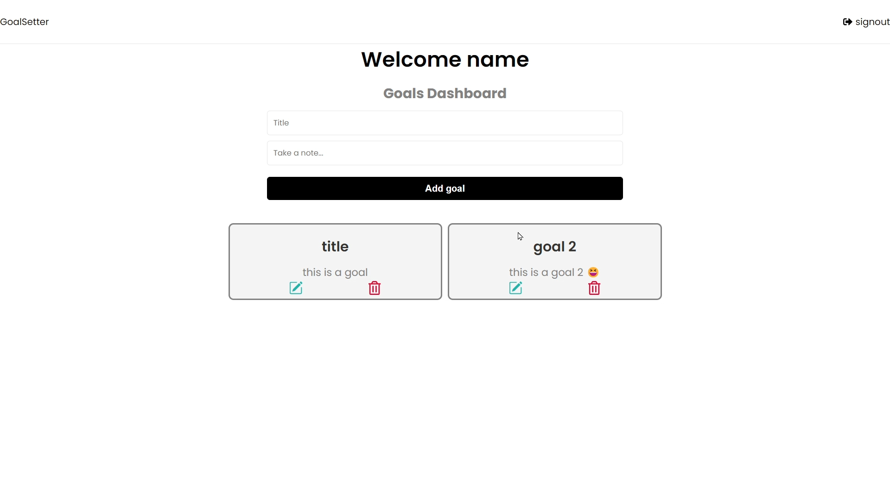
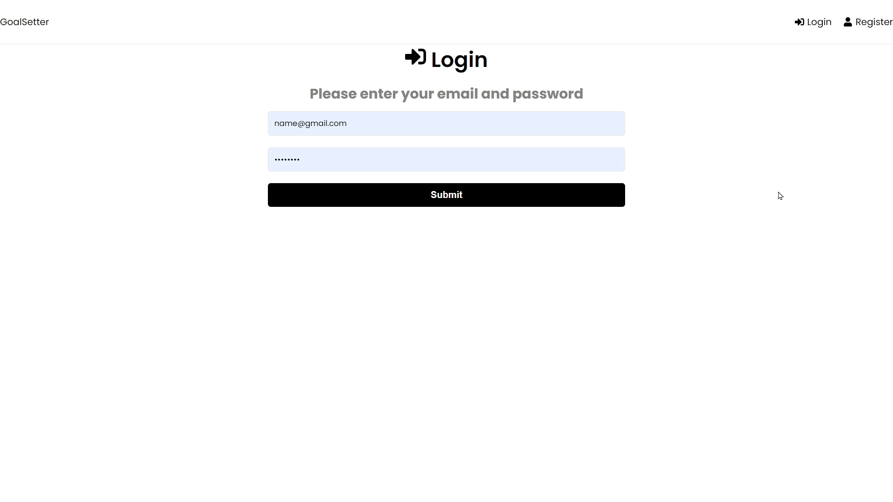
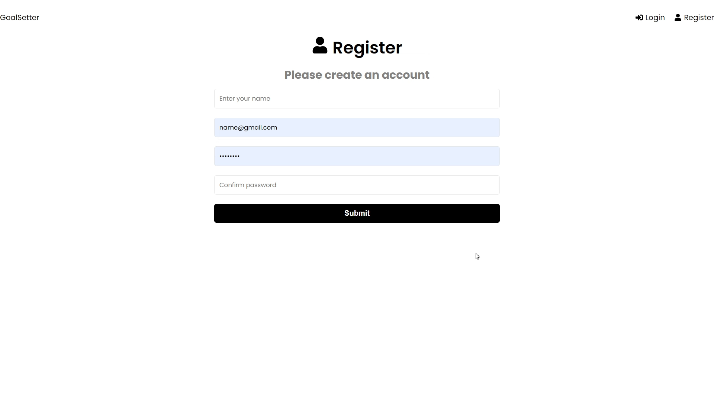

# mern-Goals
A simple CRUD application with user authentication and authorization made with MERN stack.

## backend ##
* The backend is developed using nodejs, Express and Mongodb as database.
* Basic Authentication (Register/Login with hashed password using bcryptjs).
* JWT Tokens : make requests with a token after login with Header "Authorization" with value "Bearer yourToken".
* You can access the backend RESTapi using this [link](https://mernbackend-mao3.onrender.com "backend")

**METHODS**
Description      | HTTP Method   |      URL         |   Payload   |  Response             |
-------------    | ------------- | -------------    |------------ |--------------         |
user information | GET           | /api/users/me    |    P1       |  user data with token |
Login            | POST          | /api/users/login |    P2       |  "                    |
Register         | POST          | /api/users/      |    P3       |  "                    |
get goals of user| GET           | /api/goals       |    P4       |[user goals]           |
Create goals     | GET           | /api/goals       |    P5       |P5 with id             |
Update goal      | PUT           | /api/goals/id    |    P6       |     "                 |
Delete goal      | DELETE        | /api/goals/id    |    NA       |  id                   |

```javascript
P1 - {"Authorization" : Bearer token <The user token which he recieves on successful login>}
P2 - {email: <email of user (unique)>,password: <password of user>}
P3 - {name: <name of the user>, email: <email of user (unique)>, password: <password of user>}
P4 - {"Authorization" : Bearer token <The user token which he recieves on successful login>}
P5 - {title: <title of task>, text: <body of task>}
P6 - {title: <title of task>, text: <body of task>}
```  

## frontend ##
* The frontend is developed using react.
* It is made into single page application using react router dom.
* The routes are protected until the user is authenticated.
* Click [here](https://premforreal.github.io/mern-Goals/ "backend") to visit the website.
------
### dashboard ###


------
### login ###


------
### register ###


------
